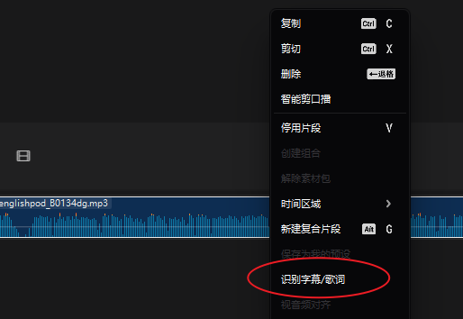
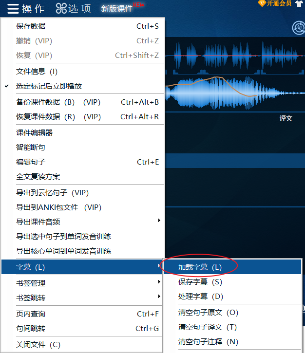
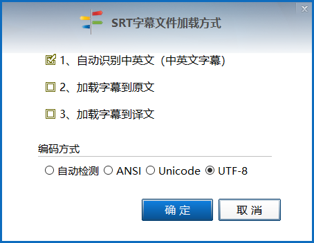
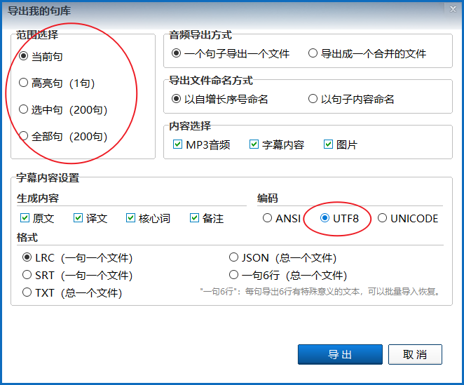
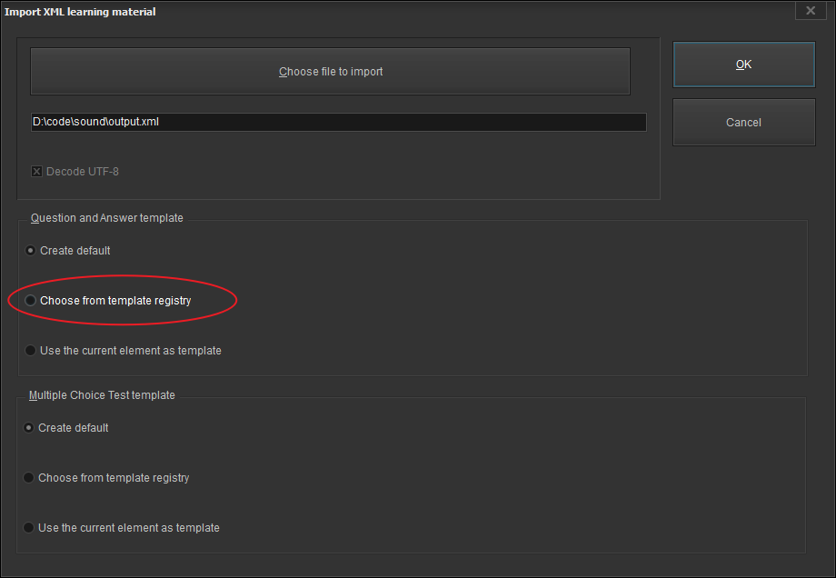
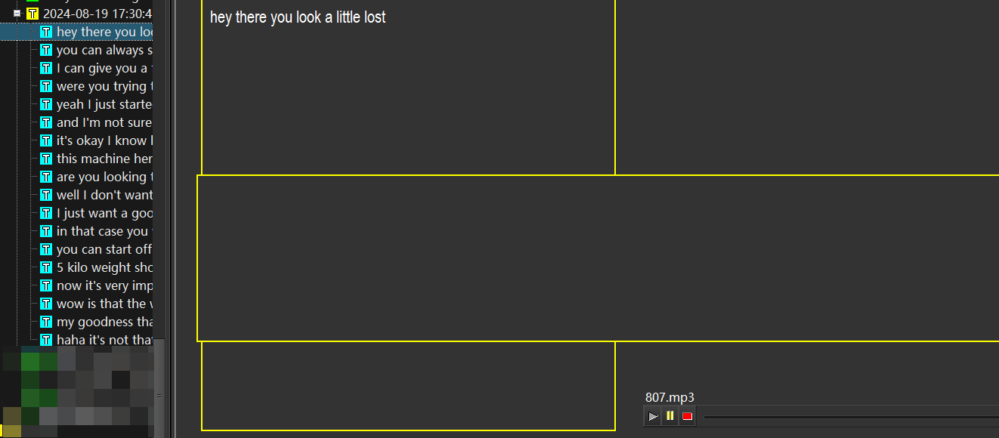

# 如何批量将音频和字幕导入到SuperMemo中

原创 生姜大叔 生姜大叔 _2024年08月20日 08:35_

很久以前，我参照余老师的代码实现将Aboboo音频导入到Anki中，现在使用上SuperMemo（以下简称为SM）了，在想能不能将这些音频和字幕直接导入到SM中来。

经过AI的辅助和一天的研究，这个想法终于实现了。

以下是简要的介绍和步骤。

## 工具简介

- **Aboboo**：用于剪辑和处理音频。
  
- **剪映**：生成字幕文件。
  
- **Python**：执行代码文件，请先配置好环境。
  

## 实现步骤

### 生成字幕：

打开剪映，添加音频，将音频拖入轨道上，右击生成字幕文件，

完成后，点击导出，将字幕文件导出srt格式。

### 切割音频：

在Aboboo中打开音频，软件会自动分割音频。[如何分割音频？给你推荐听力学习神器——Aboboo](http://mp.weixin.qq.com/s?__biz=MzA3ODI3MjkyNg==&mid=2247485412&idx=1&sn=c61ae0f3f1898c815b506e630f4b405e&chksm=9f440715a8338e03068a0c5124418ed2cc45cf8216115ae130b9cd28a06168ed8a77b9aeb983&scene=21#wechat_redirect)

导入字幕

选择字幕的编码  

并根据字幕调整分割位置。

根据需要，选中需要导出的单句，并在导出时选择UTF-8编码，以避免识别错误。

### 生成XML文件的代码

这个代码也可以在我的库中找到：[aboboo2xml.py](aboboo2xml.py)

代码文件如下：

	import os
	import xml.etree.ElementTree as ET
	from xml.dom import minidom
	import glob
	import logging
	import time
	import uuid
	logging.basicConfig(level=logging.INFO)
	
	from datetime import datetime
	
	time_string = datetime.now().strftime("%Y-%m-%d %H:%M:%S")
	logging.info(f"time_string: {time_string}")
	
	def create_supermemo_xml(folder_path, output_file):
	
	    lrc_files = glob.glob(r'*.lrc')
	
	    lrc_file_count = len(lrc_files)
	    logging.info(f"lrc_file_count: {lrc_file_count}")
	
	    flist_mp3 = glob.glob(r'*.mp3')
	
	    # Create the root element
	    root = ET.Element("SuperMemoCollection")
	    ET.SubElement(root, "Count").text =  str(lrc_file_count)
	
	    secondRoot =  ET.SubElement(root, "SuperMemoElement")
	    ET.SubElement(secondRoot, "Type").text = "Topic"
	    ET.SubElement(secondRoot, "Title").text = time_string
	
	    ET.SubElement(secondRoot, "ID").text = "111"
	
	    # Get all LRC files in the folder               
	
	    for lrc_file in lrc_files:
	        logging.info(f"lrc_file: {lrc_file}")
	        # Find the corresponding MP3 file
	        mp3_file = lrc_file.replace('.lrc', '.mp3')
	        logging.info(mp3_file)
	        if not os.path.exists(os.path.join(folder_path, mp3_file)):
	            print(f"Warning: No matching MP3 file found for {lrc_file}")
	            continue
	
	        # Parse the LRC file
	        with open(os.path.join(folder_path, lrc_file), 'r', encoding='utf-8') as f:
	            lines = f.readlines()
	            logging.info(f"lines: {lines}")
	
	        # Process each line in the LRC file
	        for line in lines:
	            logging.info(f"line: {line}")
	            if line.strip() :  # Ignore empty lines and time stamps
	            # if line.strip() and not line.startswith('['):  # Ignore empty lines and time stamps
	                # Create a new SuperMemoElement
	
	                element = ET.SubElement(secondRoot, "SuperMemoElement")
	
	                # Set the Type
	                ET.SubElement(element, "Type").text = "Topic"
	                # 使用 os.path.splitext() 分割文件名和扩展名
	                filename_without_extension = os.path.splitext(lrc_file)[0]
	                ET.SubElement(element, "ID").text = filename_without_extension
	
	                # Create the Content element
	                content = ET.SubElement(element, "Content")
	
	                # Set Question and Answer (assuming the line contains both, separated by a delimiter)
	                parts = line.strip().split('|')  # Adjust the delimiter as needed
	                logging.info(f"parts: {parts}")
	
	                # 使用split()方法
	                ET.SubElement(content, "Question").text = line.split(']', 1)[1]  # 分割后取第二部分
	
	                # Add Sound element
	                sound = ET.SubElement(content, "Sound")
	                ET.SubElement(sound, "Text").text = os.path.splitext(mp3_file)[0]
	                ET.SubElement(sound, "URL").text = os.path.abspath(os.path.join(folder_path, mp3_file))
	                ET.SubElement(sound, "Name").text = mp3_file
	                # ET.SubElement(sound, "Answer").text = "T"
	
	    # Create a formatted XML string
	    rough_string = ET.tostring(root, 'utf-8')
	    reparsed = minidom.parseString(rough_string)
	    pretty_xml = reparsed.toprettyxml(indent="    ")
	
	    # Write to the output file
	    with open(output_file, 'w', encoding='utf-8') as f:
	        f.write(pretty_xml)
	
	# Example usage
	folder_path = ''
	output_file = 'output.xml'
	
	create_supermemo_xml(folder_path, output_file)
	print(f"XML file has been created: {output_file}")

将以上代码保存为savetoxml.py后，将py文件移动或复制到上一步导出的音频文件夹中，使用VScode或是Python编辑器打开。

在VScode中按F5运行本代码，会将当前目录下的音频和字幕文件生成一个XML文件。

在SuperMemo中导入这个XML文件，导入时选择一个音频的模板

这样就即可实现音频与字幕的对应显示。
导出效果如下：

SM默认使用了问答样式，会多一个文本框，需要手动删除。

## 实际操作中的问题

剪映低版本生成的字幕可以导出，但是没有翻译，可以将字幕发给AI翻译。高版本可以翻译，不过要会员才能导出。

在XML文件中，我生成的是Topic模板，这样便于你自己挖空内容。

如果你需要直接生成Item测试卡片，可以使用另外一个代码文件生成，文件在我的仓库中：[导出为测试卡](supermemo-xml-item.py)，这样生成的就是一个测试卡。

大家也可以访问[我的仓库](https://github.com/NewOneTcm/Aboboo2Xml) 给我提一些修改意见。

### 总结

通过使用剪映生成字幕、使用Python代码将文件保存到XML文件，你可以将音频和字幕顺利导入到SuperMemo中，提升你的学习效率。

如果有任何问题，欢迎大家讨论。
